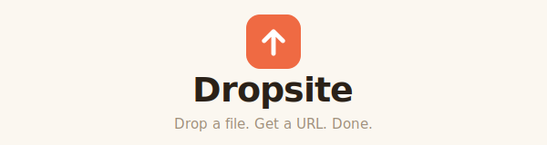

<div align="center">



A simple, Netlify-like service for hosting prebuilt static sites —
single-page HTML files, Claude-generated docs, or full multi-file zips.

</div>

## What it does

- **Drop a file → get a URL.** Upload a bare `.html` (or a `.zip`/`.tar.gz`) and
  it's live at `/s/{slug}/`. Slug is auto-generated from the filename, or you can
  pass one.
- **Versioned + instant rollback.** Every upload is an immutable deployment in S3;
  the live version is a pointer flip. Roll back without re-uploading.
- **`<base href>` injection** fixes relative paths for multi-file sites.
- **Per-site `dropsite.json`** for SPA fallback, custom 404, response headers,
  and clean URLs.
- **Auth:** LDAP login + a break-glass superadmin (env-configured).

## Architecture

>See [`DESIGN.md`](DESIGN.md) for more details.

One FastAPI app serves the dashboard, the upload API, **and** the sites:

```
   /admin/*  ──▶  control plane (login, deploy, rollback, delete)  ──▶ LDAP
   /api/*    ──▶                                                   ──▶ Postgres (metadata)
   /s/{slug} ──▶  serving (S3 proxy + in-memory LRU + <base> inject) ──▶ S3 (files)
```

- **Storage:** S3 (content-addressed by deployment id). No PVC.
- **Cache:** in-memory LRU keyed by deployment id, so a redeploy auto-invalidates.
- **Metadata:** Postgres (`sites`, `deployments`, `site_members`, `users`, `audit_log`).

## Run it locally

Requires Docker (for MinIO S3 + Postgres) and Python 3.11+.

```bash
cd dropsite
docker compose up -d                      # MinIO (S3, :9000/:9001) + Postgres (:5432)

python -m venv .venv && . .venv/bin/activate
pip install -e ".[dev]"

# Set a break-glass superadmin so you can log in without LDAP, and write .env:
cp .env.example .env
echo "SUPERADMIN_USER=admin"                                  >> .env
echo "SUPERADMIN_PWHASH=$(python -m app.auth hash 'changeme')" >> .env

uvicorn app.main:app --reload
```

Open <http://localhost:8000/admin>, sign in as `admin` / `changeme`, and drop a file.
The MinIO console is at <http://localhost:9001> (`dropsite` / `dropsite-secret`).

Or via curl (after logging in to get a cookie — easiest through the UI):

```bash
curl -F "file=@report.html" http://localhost:8000/api/deploy   # needs auth cookie
```

## Auth & the superadmin break-glass

Login does an LDAP bind (`LDAP_URL` etc. in `.env`) and issues a signed session
cookie. There is also a **break-glass superadmin** that bypasses LDAP — useful
when LDAP is down or during initial bring-up.

Its credentials come **only from environment variables**, never hardcoded in
source: set `SUPERADMIN_USER` and `SUPERADMIN_PWHASH` (a bcrypt hash). It's
disabled unless both are set. Generate the hash with:

```bash
python -m app.auth hash '<password>'
```

In production, inject these via environment secrets — do not commit a real hash.

## `dropsite.json`

Place at the upload root to control serving behavior:

```json
{
  "spa": true,
  "notFound": "404.html",
  "cleanUrls": true,
  "headers": { "X-Frame-Options": "DENY" }
}
```

## Tests

```bash
pip install -e ".[dev]"
python -m pytest          # 65 tests; uses moto (mock S3) + SQLite — no Docker needed
```

## Status

All phases implemented: core loop, multi-site + rollback, auth, siteconfig +
retention/audit/delete, and the **Dropsite Warm (Coral)** admin UI — a single-page
Upload → Review → Publishing → Live → My sites flow wired to the real API.
